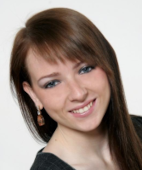
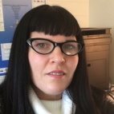

# Collaborators

### Andrew Severin

{: .align-left}
Andrew Severin is the manager of the Genome Informatics Facility. My group works at the interface between genetics and bioinformatics translating big data into informative data for interesting biological questions. I work with a wide variety of organisms from viruses, mycoplasmas and bacteria to soybean, maize, Arabidopsis, potato, nematode, pig, painted turtle, bees, wasps, zebrafish, abalone and yellowtailtuna. My broader research interests include understanding how a genome relates to a phenotype from a systems biology approach and comparative genomics.  The first step in this process has been the main focus for the last few years, which is the ability to create genomic resources for comparison (assembly, annotation, visualization) of many related organisms

### Sivanandan Chudalayandi

{: .align-left}
My expertise is in the field of molecular biology, genetics and computational biology, modern biological research routinely produce large scale data that aid in shedding light on a phenomena or point us in a newer research direction. As an Associate Scientist at the Genome Informatics Facility, I work as a bioinformatics liaison for the USDA community at large, I contribute to the community by way of tutorials, online discussions etc. I also collaborate with researchers in my capacity as computational biologist to perform data driven discovery.

### Rick E. Masonbrink
{: .align-left}
Currently, I am an associate scientist in the Genome Informatics Facility at Iowa State University, working with a group of amazing people. Here, I work on a multitude of projects, including a continuation of my previous research. Some of these projects involve:  characterizing the genomes of endangered abalone species, assessing the cellular roles of small RNAs in nematodes, creating user-friendly bioinformatics tutorials, assessing transposition in irradiated maize, trans-splicing in nematodes, etc.  With the huge variation of collaborative projects that come into the Genome Informatics Facility, the constant influx of novel ideas creates an environment conducive to my development as a contributing member of the scientific community.

### Aleksandra Badaczewska
{: .align-left}
Alex is a Research Scientist IV at the Genome Informatics Facility at Iowa State University. Her academic background is in Chemistry and Biotechnology, with a Ph.D. in Computational Biology and broad experience in programming and designing web applications. She develops a comprehensive collection of highly customizable visualization solutions for Bioinformatics and supports software optimization for the USDA Geospatial analyses.
 

### Maryam Sayadi
{: .align-left}
I have recently joined the Genome Informatics Facility at Iowa State University. I am mostly involved in generating and updating bioinformatics tutorials. My background is protein structure and function through molecular modeling simulations. My goal is a multidisciplinary approach involving protein interaction and structure and gene regulation.

### Arun S. Seetharam
{: .align-left}
My main interests are in the fields of bioinformatics and evolutionary genomics. Currently, I am working on various projects involving next-generation sequencing including the first de novo assembly of a teosinte genome. I am also developing pipelines to streamline the assembly and annotation process for newly sequenced organisms. My long-term goal is to study the genome organization and evolution of grass species.

### Jennifer Chang
{: .align-left}
I am an Iowa State University graduate, with a PhD in Bioinformatics and Computational Biology. I have been programming (in one language or another) since 2006 and have an interest in data visualization and software development. My research focus has been on analyzing and merging networks, monitoring the evolution of influenza A viruses in swine, and writing cross-platform pipelines. In 2020, I joined the Genomics Informatics Facility in the hopes of developing interdisciplinary pipelines and tutorials to meet the needs of the widespread research community.

### Swapna Menon

{: .align-left}
Swapna is a bioinformatics freelancer based in India. Her formal qualifications include an M.S. in Molecular Sciences and an M. Phil. in Bioinformatics. She analyzes microarray and NGS data for research groups in academic institutions. She helps clients with experimental design and sequence data issues. Earlier, she taught bioinformatics in universities in Kochi. The sequencing technologies are advancing. Bioinformatics software and analyses methods are keeping pace. Practicing bioinformatics requires knowledge of statistics, information technology and NGS technologies and, biology. Open source software and educational resources are vital for all bioinformatics practitioners.

### Margaret Woodhouse

{: .align-left}
I am computational biologist for the USDA maize database MaizeGDB. My research interests are in comparative and evolutionary genomics. I have helped to develop MaizeGDB into a multi-genome, pan-genome database.  I also collaborate with various universities and agencies in the United States and around the world to sequence, assemble, analyze, and steward the genomes of maize. My long-term goal is to harness the power of deep learning and the enormous amount of plant genomic and functional data to predict the functions of loci in maize.

### Sharu Paul

{: .align-left}
Sharu is a Visiting Scientist at the Genome Informatics Facility at Iowa State University. His background is in Biotechnology with a Ph.D. in Genetics and Genomics. He is using a diverse array of bioinformatic analyses to solve big data problems and contribute to developing workshops and tutorials for USDA scientists.
