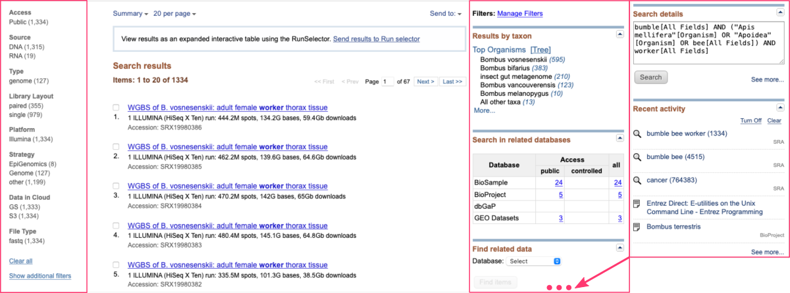
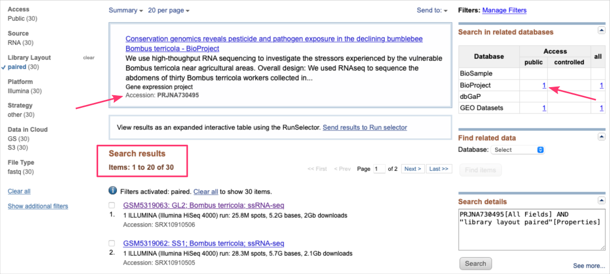
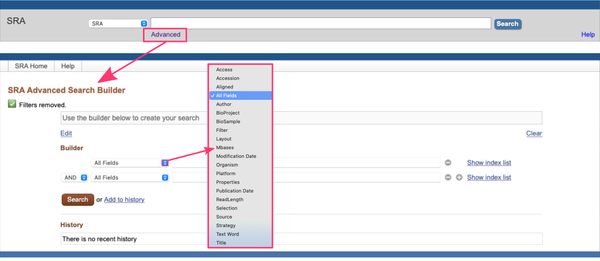
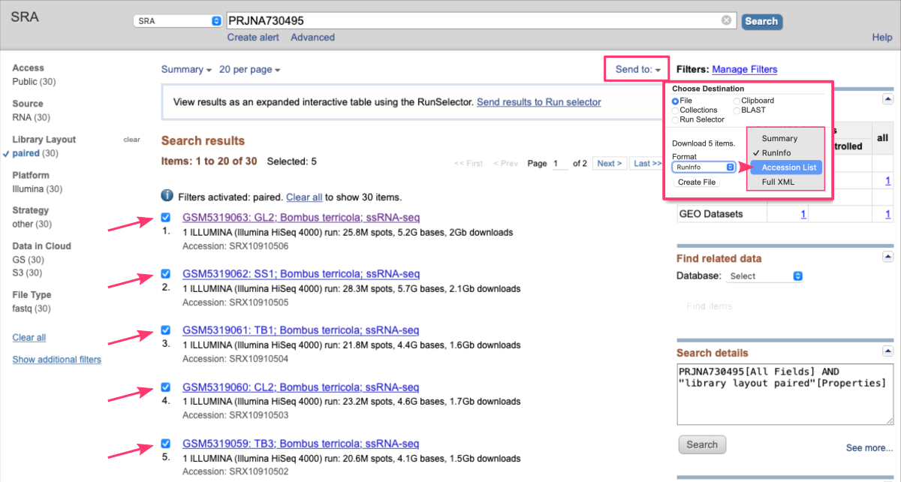
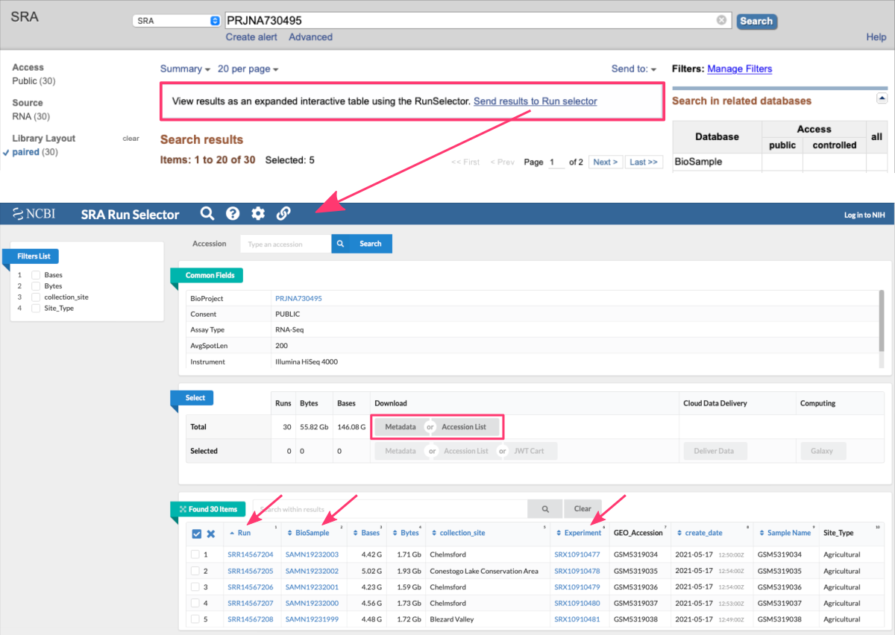



# Introduction to **S**equence **R**ead **A**rchive

<div style="background: #dff5b3; padding: 15px;">
<span style="font-weight:800;">NOTE:</span>
<br><span style="font-style:italic;">
Sequence Read Archive (<b>SRA</b>) is a publicly accessible repository that serves as a <b>centralized resource for storing and sharing high-throughput sequencing data</b>. It is maintained by the National Center for Biotechnology Information (<b>NCBI</b>), which is a part of the United States National Library of Medicine (<b>NLM</b>).
</span>
</div><br>


The **SRA database:** <a href="https://www.ncbi.nlm.nih.gov/sra" target="_blank">https://www.ncbi.nlm.nih.gov/sra</a> primarily focuses on storing next-generation sequencing (<b>NGS</b>) data generated from a variety of platforms, such as *Illumina*, *Ion Torrent*, *PacBio*, and others. These sequencing technologies generate vast amounts of **raw sequence data**, often referred to as `reads` which can be used for diverse biological and biomedical research purposes.

The SRA database provides a comprehensive infrastructure to organize, store, and **retrieve sequencing data**. It supports data compression techniques to optimize storage space while maintaining data integrity. The stored data is **annotated with essential metadata**, including:
* experimental details,
* sample information,
* sequencing platforms, and
* library preparation methods.

<span style="color: #ff3870;font-weight: 500;">Once the desired datasets are identified, users can download the raw sequencing data for further analysis using their preferred bioinformatics tools and pipelines.</span>


# Retrieve data from SRA

Researchers and institutions can submit their raw sequencing data to the SRA database, making it available for the scientific community. It enables scientists to access a vast collection of sequencing data from a wide range of organisms and research areas, promoting data reuse, meta-analyses, and the discovery of new insights.

Users can **access the SRA database through the NCBI website or programmatically** via application programming interfaces (APIs). Both approaches offers powerful search functionalities, allowing users to find specific datasets based on keywords, accession numbers, study details, organism information, or experimental attributes.

## **Search for data online**

The SRA database offers flexible search capabilities, allowing users to search by:
* keywords
* data accession identifiers
* advanced search builder

This ensures that users can efficiently find the datasets they need for their research.

**KEYWORDS** <br>
Users can enter keywords related to their research interest in the search box on the <a href="https://www.ncbi.nlm.nih.gov/sra" target="_blank">SRA database homepage  ⤴</a>. These keywords can include `gene names`, `organism names`, `disease terms`, `experimental conditions`, or any other relevant information. The database will return results that match the provided keywords.

*For example, let's search results for:* `bumble bee worker`


If you want to narrow down your search results, you can utilize various search filters available on the right and left-hand side of the search results page.



<br><br>
**DATA ACCESSION IDs** <br>
If users already know the specific accession numbers or study names of the datasets they are looking for, they can directly **enter those identifiers into the search box**. This allows for quick retrieval of the desired datasets without the need for extensive keyword searching.

<div style="background: #dff5b3; padding: 15px;">
<span style="font-weight:800;">NOTE:</span>
<br>
There are several top-level SRA entities and their accessions:
<li><b>STUDY</b>, identifiers starting with <i>SRP#, ERP#, DRP#</i></li>
<li><b>SAMPLE</b>, identifiers starting with <i>SRS#, ERS#, DRS#</i></li>
<li><b>EXPERIMENT</b>, identifiers starting with <i>SRX#, ERX#, DRX#</i></li>
<li><b>RUN</b>, identifiers starting with <i>SRR#, ERR#, DRR#</i></li>
<i>The first letter in the accession makes a notation of the source database - SRA, EBI, or DDBJ correspondingly.</i><br><br>
You can also search for BioProjects and GEO Datasets:
<li><b>PROJECT</b>, identifiers starting with <i>PRJNA#, GSE#</i></li>
</div><br>

*For example, let's assume you just read the research article* <a href="https://onlinelibrary.wiley.com/doi/full/10.1111/mec.16049" target="_blank">PMID: 34181797  ⤴</a> *and have found the Data Availability Statement reffering to BioProject* `PRJNA730495`.


This time, the *Search results* show all items related to a single `BioProject`. At the top of the page, you can also find a direct link to the `related publication`.



<span style="color: #0ba37f; font-weight: 600;"> EXERCISE FOR YOU: </span>
* Find one specific study: SRP006081 <a href="https://www.ncbi.nlm.nih.gov/sra/?term=SRP006081" target="_blank">[solution]  ⤴</a>
* Find studies with consecutive accessions using wild card: SRP00608* <a href="https://www.ncbi.nlm.nih.gov/sra/?term=SRP00608*" target="_blank">[solution]  ⤴</a>
* Find two specific studies: SRP006081 OR SRP006083 <a href="https://www.ncbi.nlm.nih.gov/sra/?term=SRP006081+OR+SRP006083" target="_blank">[solution]  ⤴</a>

<br><br>
**ADVANCED SEARCH BUILDER** <br>
The SRA database provides an Advanced Search feature that allows users to construct more complex and customized queries. By clicking on the `Advanced` link below the search box, users can access the *Advanced Search Builder*. By utilizing this tool, users can create sophisticated queries to retrieve datasets that match their specific requirements.

<div style="background: #cff4fc; padding: 15px;">
<span style="font-weight:800;">PRO TIP:</span>
<br><span style="font-style:italic;">
Advanced Search Builder is especially helpful when users have complex search criteria or need to refine their search based on multiple parameters.
</span>
</div><br>



The Advanced Search Builder includes various fields and filters that users can combine to construct their queries. These include:
* **Keywords** <br> *Users can enter specific keywords related to their research interests.*
* **Filters** <br> *Users can apply filters such as organism, platform, study type, library source, instrument model, and more to narrow down the search results.*
* **Operators** <br> *Users can use logical operators like* `AND`, `OR`, *and* `NOT` *to combine search terms and create more precise queries.*


<span style="color: #ff3870;font-weight: 500;">To get started with Advanced Search Builder please follow the instructions provided in the <a href="https://www.ncbi.nlm.nih.gov/sra/docs/srasearch/#advanced-search-in-the-sra-advan" target="_blank">official SRA docs  ⤴</a>.</span>


## **Obtain run accessions** `SRR#` identifiers


In the SRA database, a `Run` or `Run accession` refers to a unique identifier assigned to a specific sequencing run results within a dataset. Each sequencing run corresponds to a set of raw data files generated from a single sequencing library. <br>
**Run accessions** `SRR#` **are used to download raw sequencing data fom SRA database.**

You can obtain run accessions in a few ways:
* A. manually from online SRA `Search results`
* B. manually from online SRA `Run Selector`
* C. automatically in the command line


### A. manually from SRA `Search results`

Once you refined your SRA search online (see section [Search for data online](#search-for-data-online)) and see the list of results, explore search results and get run accessions.

1. Review the `Search results` and check all the items you want to download. <br> **NOTE:** *If you do not check any box, by default all results will be prepared for download.*

2. Then, on the top of the page: <br>
• click `Send to` button and check the radiobutton `File` <br>
• from the `Format` dropdown select the option `Accession List` <br>
• download this file by clicking the `Create File` button <br>
• make sure to move this file to the location where you want to download the raw datasets *(i.e., from which you are running the SRA Toolkit)*



By default, the downloaded file is named `SraAccList.csv` and contains a single column with `Run accessions`:
```
acc
SRR14567204
SRR14567205
SRR14567206
SRR14567207
SRR14567208
...
```


### B. manually from SRA `Run Selector`

Alternatively, once you refined your SRA search online (see section [Search for data online](#search-for-data-online)) and see the list of results, you can easily switch to the `SRA Run Selector` view. This online SRA tool provides a powerful and interactive interface that allows users to filter and sort the sequencing runs based on their preferences.

<div style="background: #dff5b3; padding: 15px;">
<span style="font-weight:800;">NOTE:</span>
<br><span style="font-style:italic;">
The Run Selector view enhances the usability of the SRA database by presenting sequencing run information in a structured and interactive manner. It enables users to efficiently <b>explore and select the sequencing runs</b> that meet their specific research requirements, facilitating downstream analysis and data retrieval.
</span>
</div><br>



Here are some key features and functionalities of the Run Selector:
* **Filtering** <br>Users can apply filters to refine the list of sequencing runs displayed in the table. Filters are available for various attributes such as organism, library strategy, platform, read length, and more. *By selecting specific filter options, users can narrow down the runs to those that match their criteria.*

* **Sorting** <br>Users can sort the sequencing runs based on specific columns in ascending or descending order. *This allows for easy organization and identification of runs based on desired characteristics, such as release date or read length.*

* **Selection** <br>Users can select one or multiple runs from the table to further explore or download the associated sequencing data. *By selecting specific runs, users can proceed to download the data files or access more detailed information about the selected runs.*

* **Run details** <br>Clicking on a specific `Run` in the table provides additional details about that particular sequencing run. This may include information such as:
  * the experiment design,
  * library construction protocols,
  * experimental factors,
  * and other relevant metadata associated with the run.

  From there, you can also display `Reads` and **download** `FASTA/FASTQ` files **for a given Run accession**. <br>*Note, there is a download limit for 5 Gbases of Total Bases. Larger files need to be downloaded via SRA Toolkit.*


### C. via command line using EDirect tools

To obtain run accessions from the command line you will need the `esearch` and `efetch` tools which are included within <a href="https://www.ncbi.nlm.nih.gov/books/NBK25501/" target="_blank">NCBI Entrez Direct utilities  ⤴</a> (also known as E-utilities).

<div style="background: #dff5b3; padding: 15px;">
<span style="font-weight:800;">NOTE:</span>
<br>
The <b>esearch command is used to query various NCBI databases</b>, including the SRA database, to retrieve specific information or search results. <br>
The <b>efetch command</b> with the -format runinfo option will <b>retrieve the information</b> for the matching datasets, including the run accessions. <br>
<i>These tools allow you to <b>perform searches and retrieve data programmatically from the command line</b>.</i>
</div><br>

**INSTALL EDIRECT (E-utilities)** <br>
To use the `esearch` and `efetch` commands, **you would need to install E-utilities** *(i.e., the NCBI Entrez Direct utilities, **EDirect**)*, which can be obtained from the NCBI website. You can find more information and **download instructions for the EDirect** at this link: <a href="https://www.ncbi.nlm.nih.gov/books/NBK179288/#_chapter6_Getting_Started_" target="_blank">https://www.ncbi.nlm.nih.gov/books/NBK179288/#_chapter6_Getting_Started_ </a>

**RETRIEVE SRRs** <br>
Once you have installed NCBI's **EDirect**, you can use the `esearch` command to search the SRA database and obtain the necessary information, such as `Run accessions`, using the `efetch` command.

The general syntax is as follows:
```
esearch -db sra -query "your search terms" | efetch -format runinfo
```
*Replace "your search terms" with the relevant keywords or search criteria.*

For example, to get the SRR numbers associated with the BioProject `PRJNA730495`:
```
esearch -db sra -query PRJNA730495 | efetch -format runinfo > runinfo.csv
```
The output file `runinfo.csv` will contain a table with various details, including the `Run` accessions *(in the first column)*.
```
Run,ReleaseDate,LoadDate,spots,bases,spots_with_mates,avgLength,size_MB,AssemblyName,download_path,Experiment,LibraryName,LibraryStrategy,LibrarySelection,LibrarySource,LibraryLayout,InsertSize,InsertDev,Platform,Model,SRAStudy,BioProject,Study_Pubmed_id,ProjectID,Sample,BioSample,SampleType,TaxID,ScientificName,SampleName,g1k_pop_code,source,g1k_analysis_group,Subject_ID,Sex,Disease,Tumor,Affection_Status,Analyte_Type,Histological_Type,Body_Site,CenterName,Submission,dbgap_study_accession,Consent,RunHash,ReadHash
SRR14567204,2021-06-25 18:25:06,2021-05-17 12:50:50,22110877,4422175400,22110877,200,1750,,https://sra-downloadb.be-md.ncbi.nlm.nih.gov/sos3/sra-pub-zq-24/SRR014/14567/SRR14567204/SRR14567204.lite.1,SRX10910477,,RNA-Seq,cDNA,TRANSCRIPTOMIC,PAIRED,0,0,ILLUMINA,Illumina HiSeq 4000,SRP320091,PRJNA730495,3,730495,SRS9000934,SAMN19232003,simple,207648,Bombus terricola,GSM5319034,,,,,,,no,,,,,GEO,SRA1233078,,public,EEDE9E10B2038FD62970B54B892532EE,C9297792C29DD79798BDE466149A11C3
SRR14567205,2021-06-25 18:25:06,2021-05-17 12:54:45,25106715,5021343000,25106715,200,1975,,https://sra-downloadb.be-md.ncbi.nlm.nih.gov/sos3/sra-pub-zq-24/SRR014/14567/SRR14567205/SRR14567205.lite.1,SRX10910478,,RNA-Seq,cDNA,TRANSCRIPTOMIC,PAIRED,0,0,ILLUMINA,Illumina HiSeq 4000,SRP320091,PRJNA730495,3,730495,SRS9000933,SAMN19232002,simple,207648,Bombus terricola,GSM5319035,,,,,,,no,,,,,GEO,SRA1233078,,public,179BB8F87C8E7AEA09AFD31EA47B17CB,15F09D8C96B02C734C1FD0701A5BACF9
SRR14567206,2021-06-25 18:25:06,2021-05-17 12:54:14,21165129,4233025800,21165129,200,1624,,https://sra-downloadb.be-md.ncbi.nlm.nih.gov/sos3/sra-pub-zq-24/SRR014/14567/SRR14567206/SRR14567206.lite.1,SRX10910479,,RNA-Seq,cDNA,TRANSCRIPTOMIC,PAIRED,0,0,ILLUMINA,Illumina HiSeq 4000,SRP320091,PRJNA730495,3,730495,SRS9000935,SAMN19232001,simple,207648,Bombus terricola,GSM5319036,,,,,,,no,,,,,GEO,SRA1233078,,public,F59A9C00EED65826E0F40DF85CA0E512,F76970E0700A354530E7C0F28B0E0599
SRR14567207,2021-06-25 18:25:06,2021-05-17 12:53:18,22777492,4555498400,22777492,200,1775,,https://sra-downloadb.be-md.ncbi.nlm.nih.gov/sos3/sra-pub-zq-24/SRR014/14567/SRR14567207/SRR14567207.lite.1,SRX10910480,,RNA-Seq,cDNA,TRANSCRIPTOMIC,PAIRED,0,0,ILLUMINA,Illumina HiSeq 4000,SRP320091,PRJNA730495,3,730495,SRS9000936,SAMN19232000,simple,207648,Bombus terricola,GSM5319037,,,,,,,no,,,,,GEO,SRA1233078,,public,9A865DAAC8CB2F9336A553C44D371CCB,509CFAFFD98F8877B09D19E31305F0EE
...
```
You can modify the above command to **retrieve only the** `SRR#` **identifiers**:
```
esearch -db sra -query PRJNA730495 | efetch -format runinfo | cut -d "," -f 1 > SRR.numbers
```
The content of the `SRR.numbers` file will be like that:
```
Run
SRR14567204
SRR14567205
SRR14567206
SRR14567207
...
```

## **Download SRA data files**

To download raw data files from SRA database you have a few options. All of them assume that you have a list of `Run accessions`, i.e. the `SRR#` identifiers for data gathered for samples of your interest.

<span style="color: #ff3870;font-weight: 500;">Please see section </span> **[Obtain run accessions SRR#](#obtain-run-accessions-srr)** <span style="color: #ff3870;font-weight: 500;">to learn how to retrieve identifiers of samples from SRA database. </span>

Once you have a file with all `Run accessions` **SRR#**, for example:
```
SRR14567204
SRR14567205
SRR14567206
SRR14567207
```
please follow the instructions for the approach of your choice:
* **command line approaches:**
  * [A. using SRA Toolkit](#a-using-sra-toolkit)
  * [B. using Linux Commands](#b-using-linux-commands)
  * [C. using Aspera Connect](#c-using-aspera-connect)

## A. using SRA Toolkit

The NCBI's **SRA Toolkit provides command-line utilities to download and manipulate SRA data**.
This software suite has been configured to connect to NCBI databases (including SRA) and download data via FTP or HTTPS.

**Install SRA Toolkit on your local machine** <br>
Visit the NCBI SRA Toolkit repository (<a href="https://github.com/ncbi/sra-tools/wiki/01.-Downloading-SRA-Toolkit" target="_blank">https://github.com/ncbi/sra-tools/wiki/01.-Downloading-SRA-Toolkit</a>) to download and install the SRA Toolkit appropriate for your operating system.

**Load SRA Toolkit module on the HPC infrastructure** <br>
On an HPC (High-Performance Computing) cluster, it is common for administrators to preinstall various software packages and tools to provide users with a consistent and accessible computing environment. The SRA Toolkit, including its command-line utilities, is one such tool that may be preinstalled on the HPC cluster.

When the SRA Toolkit is installed on an HPC cluster, it is **typically made available as a module**. *A module is a software management system that allows users to load or unload specific software packages and their associated environments.*

1. Check available modules:
```
module avail sratoolkit
```
<i>This command displays the software variants that have been preinstalled and are ready to be loaded. <br>For example:</i> `sratoolkit/3.0.0-6ikpzzj`

2. Load the selected SRA Toolkit module:
```
module load sratoolkit/3.0.0-6ikpzzj
```

**Get started with SRA Toolkit tools** <br>
Once the module is loaded, you can use tools available in the SRA Toolkit to download the raw Sequence Reads from the SRA database.

The SRA Toolkit provides a set of command-line utilities that facilitate the retrieval, manipulation, and analysis of data from the NCBI's Sequence Read Archive (SRA) database.

<div style="background: #cff4fc; padding: 15px;">
<span style="font-weight:800;">PRO TIP:</span>
<br><span style="font-style:italic;">Use the name of the command-line utility followed by the -h flag to learn more about the options available for each tool.</span>
</div><br>

| `sratoolkit` command | description |
|--------------|-------------|
| prefetch     |Downloads **binary SRA data files** based on accession numbers or a text file containing accession numbers. It retrieves the data files and saves them locally for further processing.|
| fastq-dump   |Converts SRA data files into **FASTQ format**, which is a common file format for storing sequence data. It extracts the raw sequence reads and quality scores from the SRA files.|
| sam-dump     |Converts SRA data files into **SAM/BAM format**, which is used for storing sequence alignment information. It allows you to extract alignment data from SRA files in a readable format.|
| vdb-validate |Performs **validation checks** on SRA data files to ensure their integrity and adherence to formatting standards. It can be used to verify the integrity of downloaded SRA files.|
| vdb-config   |Modifies **configuration settings** for the SRA Toolkit, such as specifying the location of downloaded files or adjusting caching options.|
| fasterq-dump |A **faster alternative to** `fastq-dump`, specifically designed for downloading and converting SRA data files into FASTQ format. It provides improved performance for large datasets.|

*The toolkit offers additional utilities and options for more advanced operations, such as filtering, subsetting, and quality control of SRA data.*

The simple command to fetch a SRA file in FASTQ format, you can use the `fastq-dump` command:

```
fastq-dump SRR447882
```
This will download the SRA file (in `sra` format) and then convert them to `fastq` file for you.
If your SRA file is paired, you will still end up with a single `fastq` file, since, `fastq-dump`, by default writes them as interleaved file. To change this, you can provide `--split-files` argument.
```
fastq-dump --split-files SRR447882
```
The downloaded `fastq` files will have `@SRR` number suffixed on all header lines of the file:

```
head -n 12 SRR447882_1.fastq
@SRR447882.1.1 HWI-EAS313_0001:7:1:6:844 length=84
ATTGATCATCGACCAGAGNCTCATACACCTCACCCCACATATGTTTCCTTGCCATAGATCACATTCTTGNNNNNNNGGTGGANA
+SRR447882.1.1 HWI-EAS313_0001:7:1:6:844 length=84
BBBBBB;BB?;>7;?<?B#AA3@CBAA?@BAA@)=6ABBBBB?ACA;0A=257?A7+;;&########################
@SRR447882.2.1 HWI-EAS313_0001:7:1:6:730 length=84
AGTTGATTGTGATATAGGNGTCTATCGACATTGATGCATAGGTCCTCTATTAAACTTGTTTTGTGATGTNNNNNNNTTTTTTNA
+SRR447882.2.1 HWI-EAS313_0001:7:1:6:730 length=84
A?@B:@CA:=?BCBC:2C#7>BACB??@4@B@<=>;'>@>3:86>=6@=B@B<;)@@###########################
@SRR447882.3.1 HWI-EAS313_0001:7:1:6:1343 length=84
CATCAATGCAAGGATTGTNCCATTGGTAACAATTCCACTCCTAACTTGTCAATTGATTTTCATATAACTNNNNNNNCCAAAANT
+SRR447882.3.1 HWI-EAS313_0001:7:1:6:1343 length=84
BCB@BBC+5BCA>BABBA#@4BCCA>?CBBB4CB(*ABB?ABBAACCB8ABBB?(<<B?:########################
```
Although, this normally does not affect any programs, some programs might throw an error saying that it can't process these `fastq` files. To avoid this, you an request the file to be in the orignal format (`--origfmt`). Also, note that if you're downloading files in bulk, you can save a lot of space by compressing them in gzip format (`--gzip`).
```
fastq-dump --split-files --origfmt --gzip SRR447882
```
The `fastq-dump` is also capable of doing:
 * *Additional filtering or clipping of the downloaded reads*: to remove reads with poor quality or to trim adapters. Although, this will work for the single end reads, for paired-end reads it may cause differential treatment for each pairs and might not be usable for mapping programs that needs strict pairs.
 * *Compressed format:* either as gzipped or bzipped files using `--gzip` or `--bzip2` options.
 * *fasta format*: by using the `--fasta` option


## B. using Linux commands

<div style="background: mistyrose; padding: 15px; margin-bottom: 20px;">
<span style="font-weight:800;">WARNING:</span>
<br><span style="font-style:italic;">
The NCBI Team, on October 17, 2019, announced the decommission of the SRA Fuse/FTP site and encouraged the users to try the SRA Toolkit as the recommended method of downloading the data from SRA. [<a href="https://ncbiinsights.ncbi.nlm.nih.gov/2019/10/17/users-of-the-sra-ftp-site-try-the-sra-toolkit/" target="_blank">source  ⤴</a>]
</span>
</div>

**In relation to the above warning, we encourage you to choose an approach based on the use of the SRA Toolkit.** See section [A. using SRA Toolkit]().

In cases were you cannot run the SRA toolkit or any other programs to download the file, you can still try to use the built-in commands of Linux such as `wget` and `curl`.

<div style="background: mistyrose; padding: 15px; margin-bottom: 20px;">
<span style="font-weight:800;">WARNING:</span>
<br><span style="font-style:italic;">
Note that downloading files from the SRA database using this approach is very slow (~1MB/s). <br>
Also, the files larger than 5 Gbases are not available to download using this method.
</span>
</div>

The standard web link for downloading the SRA files is: <br>
`https://trace.ncbi.nlm.nih.gov/Traces/sra-reads-be/fastq?acc=SRRNNNNNN`

<div style="background: #cff4fc; padding: 15px;">
<span style="font-weight:800;">PRO TIP:</span>
<br><span style="font-style:italic;">
In the past the working link was also this one: <br>
http://trace.ncbi.nlm.nih.gov/Traces/sra/sra.cgi?cmd=dload&run_list=SRRNNNNNN&format=fastq
</span>
</div>


You need to replace the `SRRNNNNNN` with the actual SRR number for it to work.

You can either use `wget` command:
```
wget https://trace.ncbi.nlm.nih.gov/Traces/sra-reads-be/fastq?acc=SRR14567204
```
or `curl` command:
```
curl -O https://trace.ncbi.nlm.nih.gov/Traces/sra-reads-be/fastq?acc=SRR14567204
```
If you have a large list of ids, you can simply loop it over using a `while` loop

```
while read line; do
wget https://trace.ncbi.nlm.nih.gov/Traces/sra-reads-be/fastq?acc=${line};
done < list_of_ids
```

<div style="background: #cff4fc; padding: 15px;">
<span style="font-weight:800;">PRO TIP:</span>
<br><span style="font-style:italic;">
The datasets can also be downloaded from DDBJ or EMBL using the FTP links, but the transfer speeds might be affected if you're not near their servers.
</span>
</div>


## C. using Aspera Connect

Aspera uses high-speed file transfer to rapidly transfer large files and data sets over an existing WAN infrastructure.

To get the `SRA` files:
```
prefetch --max-size 100G --transport ascp --ascp-path "/path/to/aspera/3.6.2/bin/ascp|/path/to/aspera/3.6.2/etc/asperaweb_id_dsa.openssh" SRRNNNNNN
```
This usually prefetches the SRA file to your home directory in folder named ncbi. If your home directory does not contain enough space to store all data, you may want to create another directory and softlink to the home. To do this:
```
cd ~
mkdir -p /project/storage/your_dir/ncbi
ln -s /project/storage/your_dir/ncbi
```
when you run this, you will have a directory named `ncbi` in your home, but the data is actually stored in `/project/storage/your_dir/ncbi`

```
ncbi
└── public
    └── sra
        ├── SRR006189.sra
        └── SRR006190.sra
```
Then you can convert the SRA files back to fastq format using `fastq-dump` command.
```
for sra file in ~/ncbi/public/sra/*; do
fastq-dump --split-files --origfmt --gzip ${sra};
done
```
<br><br>

# ready-made examples

## Download all SRA files related to a BioProject

NCBI Sequence Read Archive (SRA) stores sequence and quality data (fastq files) in aligned or unaligned formats from NextGen sequencing platforms. A BioProject is a collection of biological data related to a single initiative, originating from a single organization or from a consortium. A BioProject record provides users a single place to find links to the diverse data types generated for that project. Often times, once single BioProject will hold a considerable number of experiments and it gets tedious to download them all individually.

Here is the guide to show how to do this in a effecient way:

First, we need the `esearch` program for Entrez searching. So, navigate to the home directory and run the commands:
```
sh -c "$(curl -fsSL https://ftp.ncbi.nlm.nih.gov/entrez/entrezdirect/install-edirect.sh)"
sh -c "$(wget -q https://ftp.ncbi.nlm.nih.gov/entrez/entrezdirect/install-edirect.sh -O -)"
```
*This will download a number of scripts and several precompiled programs into an "edirect" folder in the user's home directory. Once you add it to your $PATH, the* `esearch` *command will be available for you from any location on the file system.*

<div style="background: mistyrose; padding: 15px; margin-bottom: 20px;">
<span style="font-weight:800;">WARNING:</span>
<br><span style="font-style:italic;">
If you are working on the HPC cluster, make sure to encapsulate the following commands in the script for workload manager (typically SLURM or PBS) and submit the job to the queue. Alternatively, you can start the interactive session on the computing node: <br>
<li>for SLURM use: <code>salloc -N 1 -n 4 -t 01:00:00</code></li>
<li>for PBS use: <code>qsub -I</code></li>
</span>
</div>

In the next step, load the modules that are needed:
```
module load sratoolkit
module load parallel
```

To get the SRR numbers associated with the project:
```
esearch -db sra -query PRJNA730495 | efetch -format runinfo |cut -d "," -f 1 > SRR.numbers
```

To download the corresponding SRA data all at once in parallel *(limit the number to 4 concurrent downloads)* use the following command:
```
parallel --jobs 4 "fastq-dump --split-files --origfmt --gzip {}" ::: SRR.numbers
```

**Use ready-made script for the SLURM workload manager** <br>
`download_raw_samples.sh`
```
#!/bin/bash
#SBATCH --nodes=1
#SBATCH --cpus-per-task=8
#SBATCH --time=01:00:00

module load sratoolkit
module load parallel

project='PRJNA730495'

esearch -db sra -query $project | efetch -format runinfo > runinfo.csv
cat runinfo.csv | cut -d "," -f 1 > SRR.numbers
cat SRR.numbers | parallel fastq-dump --split-files --origfmt --gzip -X 1000 {}
```

Run in the comman-line:
```
sbatch download_raw_samples.sh
```

---

[Next](../dataSets.md){: .btn  .btn--primary}
[Previous](getting-data-from-iplant-via-irods.md){: .btn  .btn--primary}
[Table of contents](../dAc_introduction.md){: .btn  .btn--primary}
