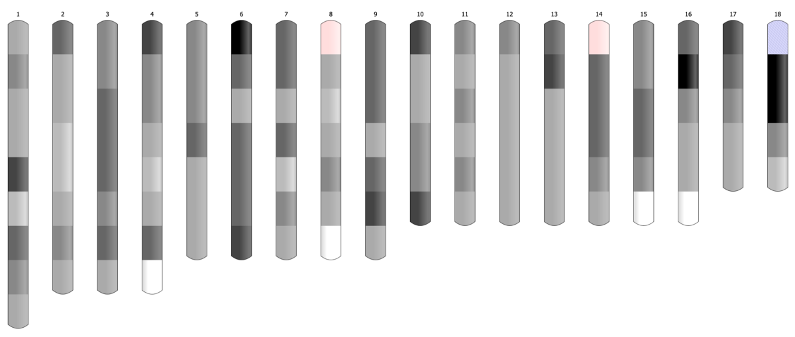
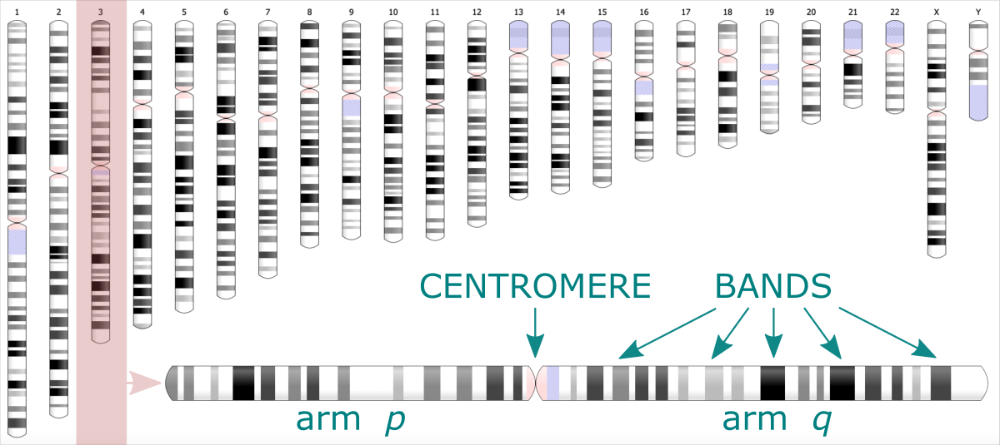



# Overview

An Ideogram, available in the <a href="https://mail.google.com/mail/u/0/?zx=r2gbow53bckx#inbox" target="_blank">dash-bio</a> set of visualization approaches, is a **diagram composed of multiple bars** displayed vertically or horizontally. The range of positions/indexes for a measured feature determine the relative length of the bar. A set of discrete **colors defines the type or intensity of a feature** along the graph.

# Applications

In ***Bioinformatics*** ideogram graph is used to **visualize the positions of genes** or microRNA along the chromosome. Easily distinguishable regions are called cytogenetic bands. The **pattern of bands** makes each chromosome unique. The ideogram shows the set of chromosomes of varying lengths, every split into two arms divided by a centromere.

Using an ideogram, you can also ***visualize the results of electrophoresis***. It is an experimental technique where the biomolecules (peptides, proteins, nucleic acids) are segregated **based on their size and electrical charge**. Depending on these properties, the **molecules migrate** through the matrix under electric current at different rates, **leaving the characteristic pattern**. Analyzing the **location and size of bands** allows for identifying the type and number of molecules.

Although the mentioned are the most common applications of the ideogram, you can also use this chart type to **visualize other data**. Typically, it is a good choice for visualizing **irregular ranges along an ordered direction**.
The **direction** can be an observation index, position, time, or any unitary variable. The difference between the highest and smallest value will **determine the length of the bar**.
Ranges or **bands** along the bar **visualize the pattern** of the analyzed feature. Different **colors** may correspond to labels, categories, or **feature types**. *For example, they can depict the species of grains crop that has given the highest yields over the decades in the last century.* But also, different **colors** can refer to the **intensity of a feature**. *For example, they can show how the amount of corn produced has changed over the decades in the last century.*

# Case study

Let's assume the corn yield **data at daily frequency was collected** (*^365 times a year at most*) for a hundred years with continuing indexing of days. Now, we are interested in **identifying general periods of shortages**. A change in the data structure is required before visualization to get an informative output. To begin with, we need to **aggregate the data to make a more coarse-grained unit of time**.

***How will we aggregate the data?***  
Most simply by summing or averaging the data from the selected period.

***How to optimize the length of the period?***   Ideally, the way to highlight the significant level of feature variability.

1) In the general scenario, we could aggregate the data over every 365 input rows, slicing it into 100 annual periods.  
2) In another variant, we could ask for ten periods only and estimate the number of rows merged into the data slice.

**However, let's suppose that data from some random days over the years are missing**.  
In this case, dividing the data into **chunks based on a fixed number of rows or slices will lose the reference to time**. (*In the first scenario, the last period will be much smaller, while in the second scenario, all periods will be equal but still smaller than 365 days, and some days can drop into the wrong year*).  
So, to solve this issue, we should **create data slices based on the increment** of the day counter, where days from the first year to the 100th year were indexed continually, including days of missing data.  
Thus, we will take all rows whose indexes match the increment range for every slice. The value increment should be 365 to create annual periods. (So, 1-365 are days indexes for the first year, 366 - 730 for the second year, etc.).  
**Note that in the slices where missing yields occurred, the count of the rows is smaller but known.** Thus, since the number of observations in periods varies, **data aggregation by averaging** over the data slice seems a more robust solution.

# Hands-on tutorial

In this practical tutorial we will use the bioinformatic data representing genetic features of species X detected in the chromosomes of newly discovered organism Y.

## Raw data

## Bin data
*Aggregate observations over value increment*

## Convert data structure

## Visualize using ideogram

### A. Use dash-bio variant (JS)

### *Upload data into the database*

### *Open ideogram in JupyterLab*

### B. Use plotly variant (PY)

### *Open ideogram in JupyterLab*
